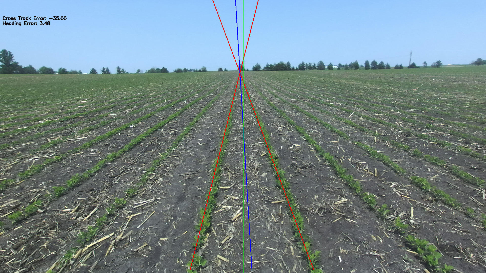
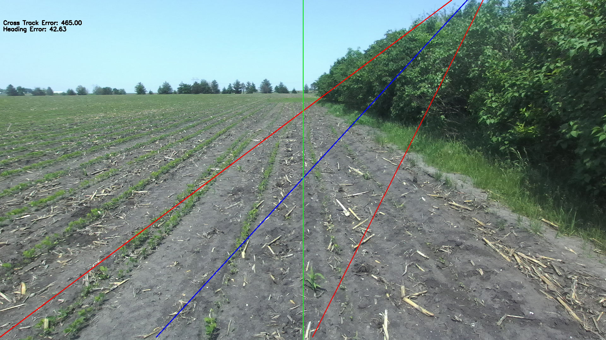
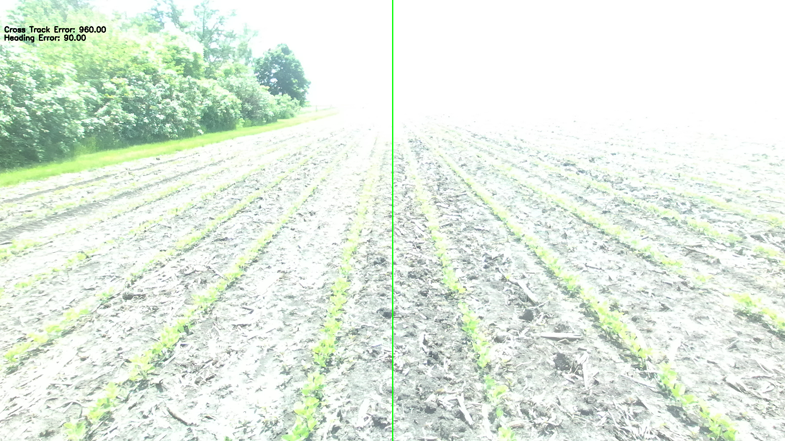

# crop_row_deteciton_salin247

## Installation

1. Clone the repository:
    ```bash
    git clone https://github.com/yourusername/crop_row_deteciton_salin247.git
    cd crop_row_deteciton_salin247
    ```

2. Create a virtual environment:
    ```bash
    python3 -m venv venv
    source venv/bin/activate
    ```
    or
    ```bash
    conda create -n salin python=3.10
    ```

3. Install the required packages:
    ```bash
    pip install -r requirements.txt
    ```

4. Add the Data folder containing the images and videos in this directory


## Usage

1. Activate the virtual environment:
    ```bash
    source venv/bin/activate
    ```
    or
    ```bash
    conda activate salin
    ```

2. To run the solution on images or the Reference image:

    ```bash
    python row_detect_images.py
    ```
    In the script

    ```python
    #uncomment this line if you want to process only one image

    # main("Reference.png",display=True)


    #comment this loop if you want to process only one image
    
    for filename in image_list:
        print(filename)
        main(filename,display=False)
    ```

3. To run the solution on video:

    ```bash
    python row_detect_video.py
    ```

## Results

On the reference image provided: "Reference.png", here are the results:



- The two red lines denote the Crop Lines
- The 90 degree green line in the centre of the image represents the heading and location of the robot
- The blue line denotes the Navigation Line
- The Cross Track Error is in the top left, it is in pixels as the camera extrinsics were not provided, if the value is negative, the robot is drifting left, and if the value is negative, the robot is drifting right
- The Heading Error is in the top left, it is given in angles


## Approach

The approach I took to solve this problem was based on [this paper](https://onlinelibrary.wiley.com/doi/10.1100/2012/484390) [1] and this [github repo](https://github.com/EarlJr53/row-crop-detection) [2]. In this paper, they use a method where they draw lines by taking a point from the bottom row and the top row and iterating over the rows, the line with the most number of green pixels on it will be considered the best line, and usually represents the crop line.

## Limitations:

- This algorithm works well when there is an even coverage of crop, but it starts to struggle when there is a sparse coverage of crop, as seen in this image. One way to solve this would be to tweak the thresholding value for green pixel to include even sparse crop coverage. This is still a challenging problem to deal with.



- Another limitation is that this algorithm doesn't work well when the lighting conditions are not ideal. In this image, the camera has been overexposed and the green pixels have been oversaturated. This causes the algorithm to not detect these green pixels and causes the algorithm to fail.



- Another limitation is that the cross track error is currently in terms of pixels, and not in terms of meters, as the camera extrinsics are not known. The cross track error also will have some deviations from it's actual value as I scaled down the image to increasing processing speed and this causes some loss in resolution.


## Future Work:

### ML based approach: 

One approach that I was trying to implement was to use a clustering algorithm like K-Means to cluster all the green points and then use a regression model to fit a line on these points. I couldn't implement this due to time constraints. I wanted to optimize the current approach. 

### Deep Learning based approach:

Another approach that I was looking into was using an end to end model to detect the crop rows and identify the heading/cross track error. This method required well labelled data.


# References:

[1] - https://onlinelibrary.wiley.com/doi/10.1100/2012/484390

[2] - https://github.com/EarlJr53/row-crop-detection
