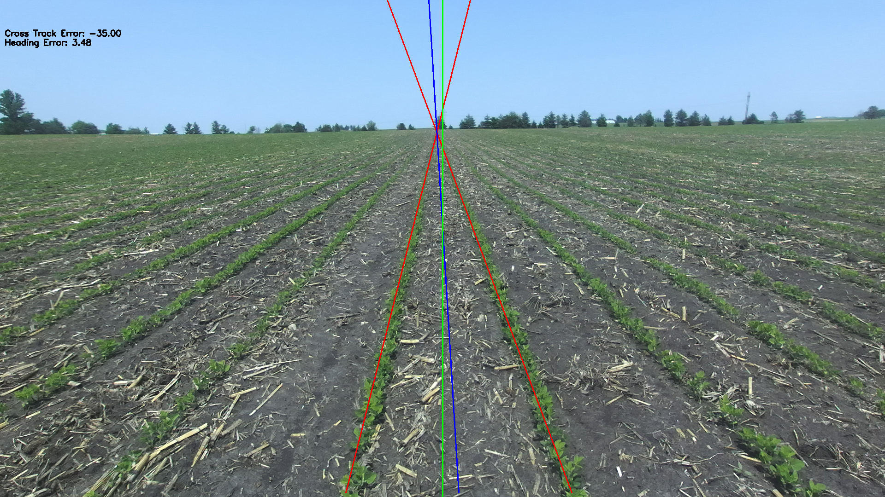

# crop_row_deteciton_salin247

## Installation

1. Clone the repository:
    ```bash
    git clone https://github.com/yourusername/crop_row_deteciton_salin247.git
    cd crop_row_deteciton_salin247
    ```

2. Create a virtual environment:
    ```bash
    python3 -m venv venv
    source venv/bin/activate
    ```
    or
    ```bash
    conda create -n salin python=3.10
    ```

3. Install the required packages:
    ```bash
    pip install -r requirements.txt
    ```

4. Add the Data folder containing the images and videos in this directory


## Usage

1. Activate the virtual environment:
    ```bash
    source venv/bin/activate
    ```
    or
    ```bash
    conda activate salin
    ```

2. To run the solution on images or the Reference image:

    ```bash
    python row_detect_images.py
    ```
    In the script

    ```python
    #uncomment this line if you want to process only one image

    # main("Reference.png",display=True)


    #comment this loop if you want to process only one image
    
    for filename in image_list:
        print(filename)
        main(filename,display=False)
    ```

3. To run the solution on video:

    ```bash
    python row_detect_video.py
    ```

## Results

On the reference image provided: "Reference.png", here are the results:



- The two red lines denote the Crop Lines
- The 90 degree green line in the centre of the image represents the heading and location of the robot
- The blue line denotes the Navigation Line
- The Cross Track Error is in the top left, it is in pixels as the camera extrinsics were not provided, if the value is negative, the robot is drifting left, and if the value is negative, the robot is drifting right
- The Heading Error is in the top left, it is given in angles


